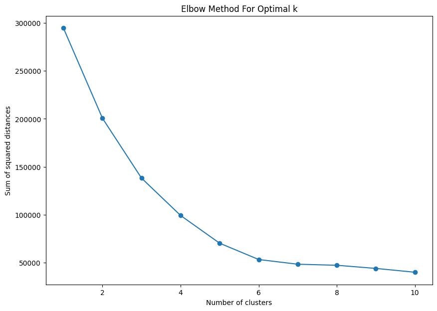
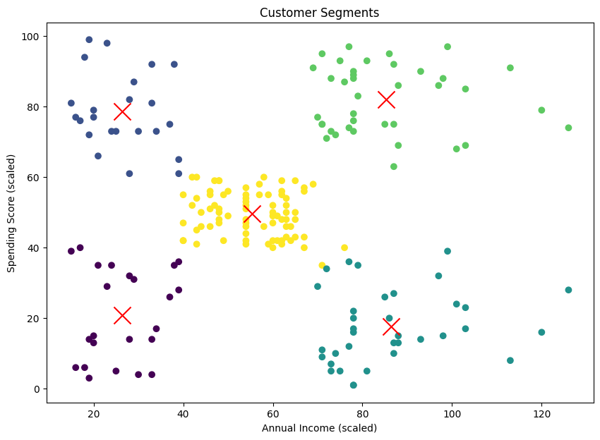
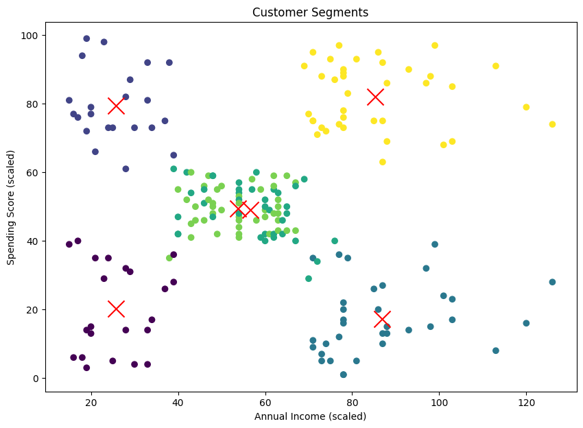
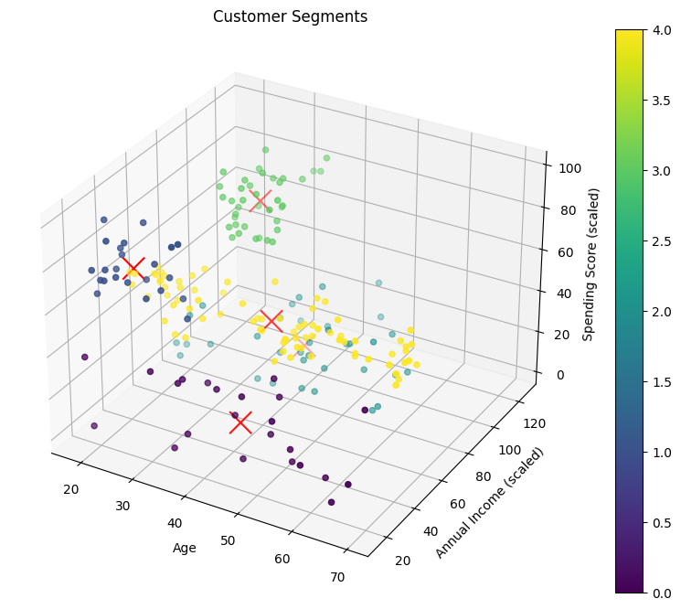
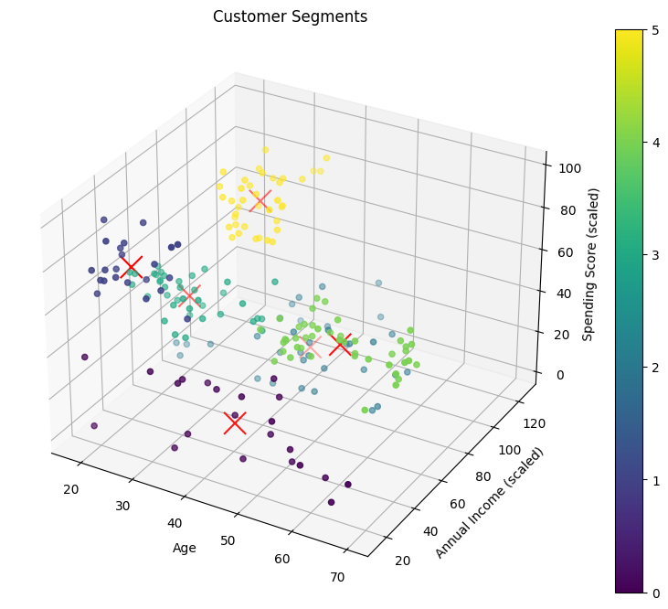

# # Prasunet_ML_02 :Customer Segmentation Using K-Means Clustering 

This project demonstrates a K-means clustering algorithm to group customers of a retail store based on their purchase history. The dataset includes features such as gender, age, annual income, and spending score. The model is developed from scratch and includes methods to detect and remove outliers, scale features, and determine the optimal number of clusters using the Elbow Method. The results are visualized in both 2D and 3D plots.

## Table of Contents

- [Introduction](#introduction)
- [Installation](#installation)
- [Usage](#usage)
- [Implementation Details](#implementation-details)
- [Results](#results)
- [File Structure](#file-structure)
- [Contributing](#contributing)
- [License](#license)

## Introduction

This project uses a K-means clustering algorithm to segment customers of a retail store into distinct groups. The dataset includes the following features:
- Gender
- Age
- Annual Income (k$)
- Spending Score (1-100)

## Installation

### Prerequisites

- Python 3.6 or higher
- `pip`

### Setting Up the Virtual Environment

1. Clone the repository:
    ```bash
    git clone https://github.com/jayesh-parmarr/Prasunet_ML_02.git
    cd customer-segmentation-kmeans
    ```

2. Create a virtual environment:
    ```bash
    python -m venv myenv
    ```

3. Activate the virtual environment:
    - **Windows**:
      ```bash
      myenv\Scripts\activate
      ```
    - **macOS and Linux**:
      ```bash
      source myenv/bin/activate
      ```

4. Install the required libraries:
    ```bash
    pip install -r requirements.txt
    ```

## Usage

The project includes a Jupyter notebook file `K-means.ipynb` that demonstrates the complete implementation of the K-means clustering algorithm from scratch.

### Running the Notebook

To run the notebook:
```bash
jupyter notebook K-means.ipynb
```

## Implementation Details
### Data Preprocessing
- Load the Dataset: The dataset is loaded from `dataset/Mall_Customers.csv`.
- Remove Outliers: Outliers are detected and removed using the IQR method.
- Feature Scaling: The features are scaled using `StandardScaler`.


## Elbow Method
The Elbow Method is implemented to determine the optimal number of clusters. The sum of squared distances (SSE) is plotted against the number of clusters to find the "elbow" point.

## K-Means Clustering
### The K-means algorithm is implemented from scratch, including:

- Initialization of Centroids
- Assignment of Clusters
- Update of Centroids
- Convergence Check

## Visualization
- 2D Plot: Clusters are visualized in 2D using 'Annual Income' and 'Spending Score'.
- 3D Plot: Clusters are visualized in 3D using 'Age', 'Annual Income', and 'Spending Score'.
## Model Evaluation
The model is evaluated using the Silhouette Score.

- Silhouette Score when `k = 5` is `0.44840809683798866`
- Silhouette Score when `k = 6` is `0.45955989969588884`

## Results
Elbow Method
The optimal number of clusters is determined using the Elbow Method. The SSE is plotted for `k = 1` to `k = 10`.


### Clustering Results
Clusters are visualized for `k = 5` and `k = 6`:

- 2D Plot for k = 5 and k = 6: Clusters are plotted using 'Annual Income' and 'Spending Score'.


- 3D Plot for k = 5 and k = 6: Clusters are plotted using 'Age', 'Annual Income', and 'Spending Score'.




## File Structure
```bash
customer-segmentation-kmeans/
├── dataset/
│   └── Mall_Customers.csv      # Dataset file
|── images                      # 5 images
├── K-means.ipynb               # Jupyter notebook for K-means implementation
├── requirements.txt            # List of dependencies
└── README.md                   # Readme file
└── LICENSE                    # License file
```
## Contributing
Contributions are welcome! Please fork this repository and submit a pull request for any features, bug fixes, or enhancements.

## License
This project is licensed under the MIT License. See the LICENSE file for details.
